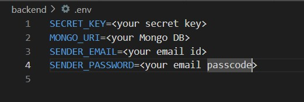

# MediConnect

MediConnect is a telehealth web application that facilitates seamless virtual interactions between doctors and patients. The platform streamlines appointment scheduling, video consultations, and patient management — all in one place.

---

## 🌐 Live Demo

👉 https://dal-mediconnect.netlify.app/

---

## 🚀 Features

- 👨‍⚕️ Doctor and Patient Registration/Login with JWT Auth
- 🗓️ Smart Appointment Scheduling with real-time conflict detection
- 📞 Secure Video Consultations (PeerJS/WebRTC)
- 💬 Encrypted Messaging with File Sharing
- 🧾 Prescriptions, Visit Notes, Medical History Management
- 📅 Google Calendar Sync for Doctors
- 📊 Doctor Dashboard with Statistics
- 🔔 Email Notifications for Appointment Reminders
- 🛡️ OWASP ZAP Security Scanning in CI Pipeline

---

## 🧪 Tech Stack
- Frontend: React + BootStrap 
- Backend: Python (Flask)
- Database: MongoDB
- Authentication: JWT
- Video & Messaging: WebRTC (PeerJS), Diffie-Hellman encryption
- DevOps: Docker, GitHub Actions (CI), OWASP ZAP

---

## 🛠️ Setup Instructions

### Prerequisites

- Node.js & npm (for frontend)
- Python 3.x (for backend)
- Flask & required Python packages

### 1. Clone the Repository

```bash
git clone https://github.com/Viishveesh/mediconnect.git
cd mediConnect
```

### 2. Run Frontend

```bash
cd frontend
npm install
# Edit URL's to https://localhost:5000 to run in local
npm run start
```

### 3. Run Backend

```bash
cd backend
# Add env variables
pip install -r requirements.txt
python app.py
```

### 🔐 Example `.env` File

Here’s an example of how to structure your `.env` file:


---

## 🛠️ Information about API

🔐 Authentication Endpoints
| Endpoint          | Method | Description                              |
| ----------------- | ------ | ---------------------------------------- |
| `/signup`         | POST   | Register a new user (doctor or patient). |
| `/login`          | POST   | Authenticate user and return JWT token.  |
| `/request-reset`  | POST   | Request a password reset link via email. |
| `/reset-password` | POST   | Reset password using a secure token.     |

👨‍⚕️ Doctor Endpoints
| Endpoint                                      | Method | Description                                                   |
| --------------------------------------------- | ------ | ------------------------------------------------------------- |
| `/doctor/profile`                             | POST   | Create a doctor profile.                                      |
| `/doctor/profile`                             | PUT    | Update a doctor profile.                                      |
| `/doctor/profile`                             | GET    | Retrieve the doctor's profile.                                |
| `/doctors`                                    | GET    | List all doctors (basic or detailed info depending on route). |
| `/doctors/search`                             | GET    | Search doctors by specialty, location, or date.               |
| `/doctors/<doctor_id>/details`                | GET    | Get detailed information about a specific doctor.             |
| `/doctor/<doctor_id>/appointments/today`      | GET    | Get today's and upcoming appointments for a doctor.           |
| `/doctor/<doctor_id>/patients`                | GET    | Get all patients for a doctor.                                |
| `/doctor/<doctor_id>/patient/<patient_email>` | GET    | Get patient basic info by email.                              |
| `/doctor/dashboard/stats`                     | GET    | Get dashboard statistics for a doctor.                        |
| `/doctors/<doctor_id>/availability`           | GET    | Get availability for a specific doctor.                       |

🧑‍⚕️ Patient Endpoints
| Endpoint                                   | Method   | Description                                   |
| ------------------------------------------ | -------- | --------------------------------------------- |
| `/patient/profile`                         | POST     | Create a patient profile.                     |
| `/patient/profile`                         | PUT      | Update a patient profile.                     |
| `/patient/profile`                         | GET      | Retrieve the patient's profile.               |
| `/patient/appointments`                    | GET      | Get all appointments for the current patient. |
| `/patient/<patient_email>/medical-history` | GET      | Get medical history for a patient.            |
| `/patient/<patient_email>/prescriptions`   | GET/POST | Get or create prescriptions for a patient.    |
| `/patient/<patient_email>/visit-notes`     | GET/POST | Get or create visit notes for a patient.      |

📅 Appointment Endpoints
| Endpoint                           | Method | Description                                       |
| ---------------------------------- | ------ | ------------------------------------------------- |
| `/book`                            | POST   | Book a new appointment and send confirmation.     |
| `/appointments/<doctor_id>/<date>` | GET    | Get booked slots for a doctor on a specific date. |
| `/appointments`                    | GET    | Get appointments for the current user.            |

💬 Messaging & Conversations
| Endpoint                                                 | Method | Description                                 |
| -------------------------------------------------------- | ------ | ------------------------------------------- |
| `/conversations`                                         | GET    | Get all conversations for the current user. |
| `/conversations/<conversation_id>/messages`              | GET    | Get messages for a specific conversation.   |
| `/conversations/<conversation_id>/send`                  | POST   | Send a message in a conversation.           |
| `/conversations/start`                                   | POST   | Start a new conversation with another user. |
| `/conversations/<conversation_id>/key-exchange/initiate` | POST   | Initiate Diffie-Hellman key exchange.       |
| `/conversations/<conversation_id>/key-exchange/complete` | POST   | Complete Diffie-Hellman key exchange.       |

🖼️ File Uploads
| Endpoint            | Method | Description                                 |
| ------------------- | ------ | ------------------------------------------- |
| `/upload`           | POST   | Upload and compress an image for messaging. |
| `/files/<filename>` | GET    | Serve an uploaded image file.               |

📹 Video Session Endpoints
| Endpoint                                       | Method | Description                                    |
| ---------------------------------------------- | ------ | ---------------------------------------------- |
| `/video/session/create`                        | POST   | Create a new video session for an appointment. |
| `/video/session/<session_id>/join`             | POST   | Join an existing video session.                |
| `/video/session/<session_id>/end`              | POST   | End a video session.                           |
| `/video/session/<session_id>/status`           | GET    | Get the status of a video session.             |
| `/appointments/<appointment_id>/video-session` | GET    | Get video session for a specific appointment.  |

📆 Google Calendar Integration
| Endpoint            | Method | Description                                       |
| ------------------- | ------ | ------------------------------------------------- |
| `/google/login`     | GET    | Initiate Google OAuth login for calendar access.  |
| `/google/callback`  | GET    | Handle Google OAuth callback and store token.     |
| `/google/sync-busy` | GET    | Sync busy slots from Google Calendar to database. |

🗓️ Doctor Schedule Management
| Endpoint                         | Method | Description                                            |
| -------------------------------- | ------ | ------------------------------------------------------ |
| `/doctor/availability`           | POST   | Add a new availability slot for a doctor.              |
| `/doctor/availability`           | GET    | Get all availability slots for a doctor.               |
| `/doctor/availability/<slot_id>` | DELETE | Delete a specific availability slot.                   |
| `/doctor/busy`                   | POST   | Add a new busy time slot for a doctor.                 |
| `/doctor/busy`                   | GET    | Get all busy time slots for a doctor.                  |
| `/doctor/busy/<slot_id>`         | DELETE | Delete a specific busy time slot.                      |
| `/doctor/schedule`               | GET    | Get combined availability and busy slots for a doctor. |

⚙️ Schedule Settings
| Endpoint                    | Method | Description                                      |
| --------------------------- | ------ | ------------------------------------------------ |
| `/doctor/schedule-settings` | GET    | Get schedule settings for a doctor.              |
| `/doctor/schedule-settings` | POST   | Update or create schedule settings for a doctor. |


